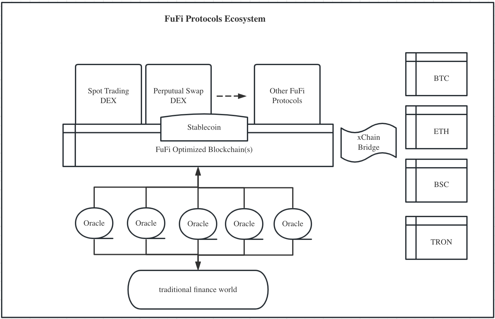

`fufi.whitepaper`

# FuFi - Future Finance Protocols

## Table of Content
  - [Why FuFi?](#why-fufi)
  - [Design Principals](#design-principals)
    - [Performance oriented](#performance-oriented)
    - [Open and transparent](#open-and-transparent)
    - [Secure while easy-to-use](#secure-while-easy-to-use)
    - [Affordable](#affordable)
  - [What is FuFi](#what-is-fufi)
    - [FuFi Protocol Ecosystem](#fufi-protocol-ecosystem)
    - [FuFi Protocols](#fufi-protocols)
  - [Contribute](#contribute)
  - [License](#license)
  
## Why FuFi?

There are so many decentralized finance (DeFi) protocols out there, running ontop of various networks and the total value locked (TVL) has reached over $2 billion globally. The largest network by DeFi TVL is Ethereum, accounting for almost half of the total volume worldwide. However, due to several inherent technology limitations of underlying networks like Ethereum or other EVM cloned blockchains, DeFi protocols' complete potentials have not been fully unleashed and their user experiences tend to be suboptimal to those in traditional finance. 

FuFi is thus hailed to provide a coherent set of DeFi protocols and underlying supporting technologies to enable the user exeprience as evidenced in traditional finance as well as serves as a bridge between the centralized and decenetralized financial world.

## Design Principals

### Performance oriented

Following performance metrics must be met:

1. second-level transaction onchain speed (thus low-latency for price updates etc)
2. second-level transaction confirmation speed
3. high-throughput: 5000 TPS with single network shard and extensible through adding network shards

### Open and transparent

Fareness is lifeblood of finance. To build an inclusive finance world, following targets must be met:
1. anyone can be a protocol user
2. open governance through Decentralized Autonomous Governance (DAO)
3. all transaction and settlement data are onchain, visible and traceable
4. protocols are verifiable against their technical papers

### Secure while easy-to-use

It's paramount important to achieve security as well as usability for end users

1. Protocols must be designed to achieve simplicity in adoption and usage
2. Reliable and trustworthy underlying network(s) will be adopted to support FuFi protocols
3. No front-running is allowed
4. No asset can be forged by any party unless specified by the corresponding whitepaper

### Affordable

It's determined that the gas model as adopted in majority blockchain technologies are not suitable for DeFi which usually invovles large volume of transactions and hence the gas cost that would daunt a lot of investors or traders. Meanwhile unfair advantages in trading could be achieved by simply leveraging or manipulating gas prices.

With the afforability, FuFi is set to achieve financial inclusiveness for majority users from around the world. Hence, the underlying network to support FuFi shall adopt a different onchain resource control mechanism other than the gas model.

## What is FuFi

## FuFi Protocol Ecosystem
FuFi is a suite of decentralized finance protocols determined to be the cornerstones of the future finance that runs entirely on a blockchain-based value system. 

<div align="center"></div>
<div align="center"><i>Figure 1.1: FuFi Protocol Ecosystem</i></div>

FuFi runs ontop of certain public blockchains that can be customized to meet both security and performance targets of FuFi protocols. In addition, following technologies are also employed/developed to achieve the ultimate goals of FuFi protocols:
   - a cross-chain bridge to allow mirrowing digital assets back and forth from other public blockchains
   - a set of decentralized oracles to allow injecting external world information onto the FuFi protocols that reside in blockchain 
  
## FuFi Protocols

FuFi supports at least the following protocols: 
  - FuFi Spot Trading DEX: [FuFi Spot Trading DEX Whitepaper](https://github.com/fufiprotocol/fufi.whitepaper/blob/main/fufi.dex-spot.md) 
  - FuFi Perptual Swap Trading DEX: [FuFi Perptual Swap DEX Whitepaper](https://github.com/fufiprotocol/fufi.whitepaper/blob/main/fufi.dex-perpswap.md)
  - FuFi Stablecoin: [FuFi Stablecoin Whitepaper](https://github.com/fufiprotocol/fufi.whitepaper/blob/main/fufi.stablecoin.md)
   

In the future, following protocols will be considered to support:
  - margin trading
  - swap/options
  - peer-to-peer lending 
  - insurance 
   
## Contribute

1. Clone the repo and checkout a branch

  ```shell
  git clone https://github.com/fufiprotocol/fufi.whitepaper.git
  git checkout -b <your-branch-name>
  ```

2. Make your changes

3. Lint files before a pull request

  ```shell
  # install markdownlint-cli from https://github.com/igorshubovych/markdownlint-cli
  markdownlint '**/*.md'  -c .github/workflows/markdownlint.yaml
  ```

4. Submit a pull request

## License

All the content are licensed under [CC BY 4.0](https://creativecommons.org/licenses/by/4.0/).

