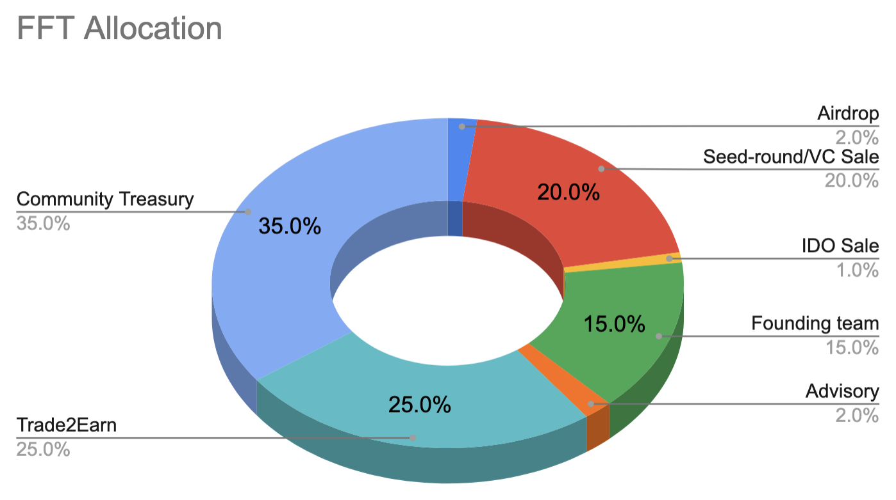
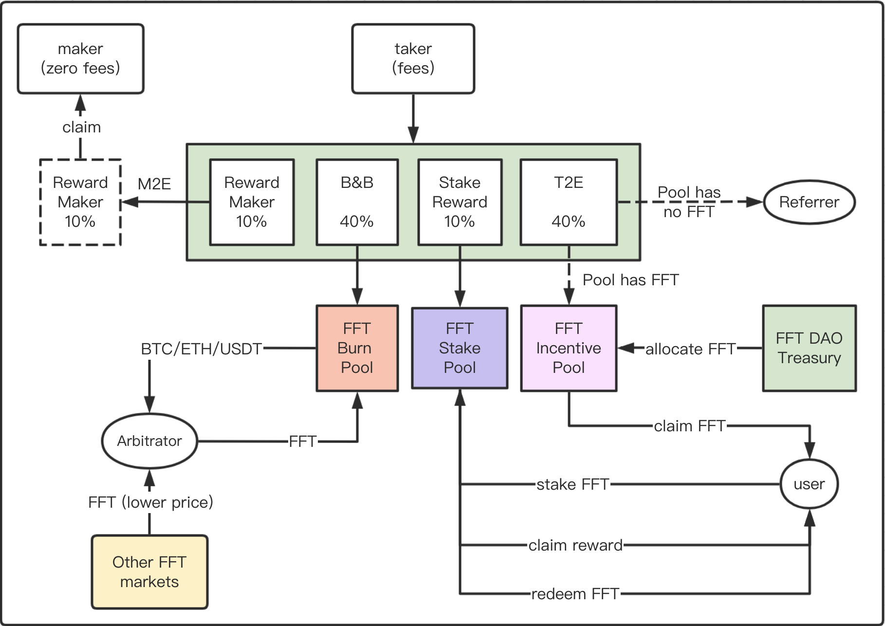

`FuFi Tokenomics`

# FuFi Token Profile

- Total supply: `10 billion`
- Symbol code: `$FFT`
- Precision: 18 on EVM chains and 4 on `Galaxy` chain

# FuFi Tokens on multiple blockchains

`$FFT` will be solely issued as as ERC20 token on Ethereum network for its pervasive ecosystem adoption. However, in order to serve its utility and governance token in FuFi protocols, `$FFT` must be bridged over from Ethereum to [Galaxy Chain](https://gax.network) via a powerful cross-chain bridge: [MilkWay](https://milkway.io)

```html
Please double confirm on the smart contract addresses with https://fufi.foundation for absolute accuracy!
```

# FuFi Token Rights

Including but not limited to the following rights/privileges:

- member fee tier based on holding amount
- voting right for listing/de-listing DEX trading pairs
- enjoy token mining in trading in FuFi Spot & Perp DEX

# Token Allocation
- `2%`: Airdrop, for early community & consensus buildup, 8 quarterly releases post 6-month lock;
- `20%`: Seed & VC-round sale, for product, market & brand development, 8 quarterly releases post 12-month lock;
- `1%`: IDO, for attracting early FuFi users and expanding global consensus, no lock required;
- `15%`: Founding team, for long-term protocol development and eventual decentralization realization, 8 quarterly releases post 24-month lock;
- `2%`: Advisory, for fund-raising and ecosystem development support, 8 quarterly releases post 24-month lock;
- `25%`: Trade-to-earn, to promote consensus among crypto users and traders, no lock required;
- `35%`: Ecosystem development treasury, DAO-driven utilization of funds for protocol, ecosystem and FuFi DAO development;

```html
Note: 8 quarterly release means 10% for each of the first 7 quarters and 30% for the final (i.e 8th) quarter.
```
<div align="center"></div>
<div align="center"><i>Figure 1.1: FFT Token Distribution</i></div>


# FuFi Incentive Mechanisms

Following incentive mechanisms have been designed to greatly encourage providing liquidity as well as trading in FuFi's spot and perpetual markets:

- `Stake2Earn(S2E)`: `10%` of taker-side trading fees will go to `$FFT` staking pool for users to share the fees;
  
As there will be a certain amount of FFT tokens circulating in the open market, holders are free to sell them whenever they feel necessary doing so. This will not be good for existing holders, new investors or buyers of the token as they see the price unstable or sometimes keep declining with more tokens circulated into the market. Staking has been a very effective and proven price stabilizing method employed in the crypto industry. FuFi provides a staking pool smart contract that accepts FFT token deposits and shares transaction fees according to the FFT token ratio within the pool.

It will become another source of profit when no FFT is in circulation or the staking pool is closed.


- `Hold2Earn(H2E)`: `20%` of taker-side trading fees will go to `$FFT` burn pool so as to buyback & burn `$FFT` Tokens;

`$FFT` is the fundamental element in FuFi’s tokenomics where seed and institutional investors benefit primarily from value increase of FFT tokens. If only through community user’s buying and selling activities, FFT token price and its market capital value won’t be very stable. Instead its price would be greatly subject to market emotions and the bear or bull cycles of the whole crypto market. In order to overcome this, FFT token will be continuously injected with the value of transaction fees. It is done as following:
  1. A Buy-back and burn pool smart contract will be created for swap of FFT and transaction fee tokens;
  2. Upon each trade settlement, 40% of taker-contributed transaction fees will be booked into the B&B pool account;
  3. Regularly triggered messages will be submitted (open to any public users) to claim the fees accumulated from step-2 into the pool account; As a result, more and more fees will be accumulated in the pool, hence leading to a continuous increase of FFT token price: 
**P = Fee Amount / N** (N is a constant, preset in the pool, E.g. 100 K)
  4. Users who are holding FFT tokens at a lower holding price or buying them from other markets at lower prices can then deposit FFT tokens into the B&B pool in exchange for the corresponding amount of tokens in the pool. As a result, FFT tokens will be burnt right away, which creates a deflation effect.

Initially `$FFT` may not have been issued yet, `H2E` will thus not be activated at all. `20%` of the transaction fees will instead go to `FuFi DAO pool` for the early investors as well as lead `$FFT` holders to share.

- `Make2Earn(M2E)`: `30%` of taker-side trading fees will go to the maker's account as reward for providing liquidity and zero fees charged to maker at all!

As liquidity is the king for every exchange, FuFi incentives makers for placing orders that will be matched and taken by takers. This way it attracts average traders or market makers to make orders over take orders, which would help with the overall liquidity of the target market. Currently, there’ll be zero fee charged to makers. Instead, makers will be rewarded with `30%` of taker’s transaction fees when their orders are matched and settled.

- `Trade2Earn(T2E)`: `40%` of taker-side trading fees will go to `$FFT` incentive pool to reward DEX takers provided that there are `$FFT` allocated for the current rewarding epoch.

To greatly incentive traders to participate in FuFi trading, 25% of total FFT tokens will be allocated to reward traders should a `T2E` campaign is active. However, each campaign will be on a fixed duration schedule, say 14 days or two weeks. By the end of each `T2E` campaign, all participating traders can claim reward FFT tokens based on their contributing amount of the transaction fees into the pool. Opening of each campaign is also carefully timed. The first campaign will be only started once the FFT price reaches over $10 cents. Subsequently each new campaign will be only started if the price increases at least 50% compared to the price logged in the previous campaign.

Traders are rewarded with FFT tokens while their contributed transaction fees in the form of other tokens or coins will be shared among a group of key contributors of this project.

While there is no `T2E` campaign, `40%` of transaction fees will be used as reward to referral’s program.

  
<div align="center"></div>
<div align="center"><i>Figure 1.2: FuFi DEX Fee Model</i></div>

```
P.S. Selection of trading pairs and the percentages will be subject to change through DAO governance
```