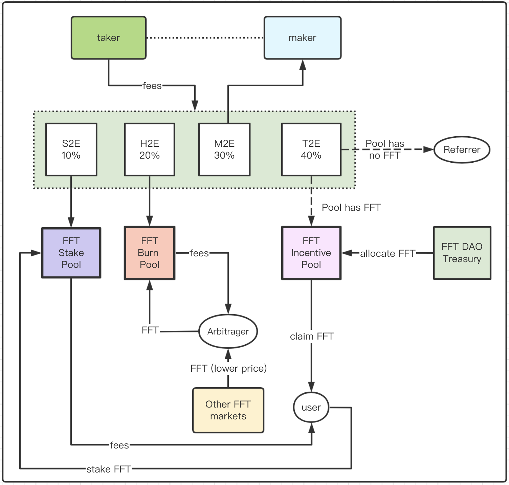

`FuFi Tokenomics`

# FuFi Token Profile

- Total supply: `10 billion`
- Symbol code: `$FFT`
- Precision: 18 on EVM chains and 4 on `$AMAX` chain

# FuFi Tokens on multiple blockchains

`$FFT` will be solely issued as as ERC20 token on Ethereum netowrk for its pervasive ecosystem adoption. However, in order to serve its utility and governance token in FuFi protocols, `$FFT` must be bridged over from Ethereum to [Armonia Meta Chain](https://amax.network) via her well-established [xChain](https://xchain.pro) bridge.

```html
Please double confirm the smart contract addresses with https://fufi.foundation for absolute accuracy!
```

# FuFi Token Rights

Including but not limited to the following rights/privileges:

- member fee tier based on holding amount
- voting right for listing/delisting DEX trading pairs
- enjoy token mining in trading in FuFi Spot & Perp DEX

# Token Allocation
- `2%`: Airdrop, for early community & consensus buildup, 8 quarterly releases post 6-month lock;
- `5%`: Seed-round sale, for product and market development, 8 quarterly releases post 12-month lock;
- `15%`: VC-round sale, for product, market development and brand awareness buildup, 8 quarterly releases post 12-month lock;
- `1%`: IDO, for attracting early FuFi users and expanding global consensus, no lock required;
- `15`: Founding team, for long-term protocol development and eventual dencentralization realization, 8 quarterly releases post 24-month lock;
- `2%`: Consultancy, for fund-raising and ecosystem development support, 8 quarterly releases post 24-month lock;
- `25%`: Trade-to-earn, to promote consensus among crypto users and traders, no lock required;
- `35%`: Ecosystem deveopment treasury, DAO-driven utilization of funds for protocol, ecosystem and FuFi DAO development;

# Token Deflation & Mining with FuFi DEXs

In order to greatly encourage providing liquidity as well as trading in FuFi's spot and perpetual markets, both makers and traders will be incentivized/rewarded in different manners:

- `Deflation`: `40%` of taker-side trading fees will go to `$FFT` burn pool so as to buyback & burn `$FFT` Tokens;
- `Trade2Earn`: `50%` of taker-side trading fees will go to `$FFT` incentive pool to reward DEX takers provided that there are `$FFT` allocated for the current rewarding epoch. When there's no `$FFT` reward in the pool, the same amount will go to the DAO Treasure as DAO community development funds;
- `Make2Earn`: `10%` of taker-side trading fees will go to the counterparty maker' account as reward for providing liquidity and zero fees charged to maker at all!
  
<div align="center"></div>
<div align="center"><i>Figure 1.2: FuFi DEX Fee Model</i></div>

```
P.S. Selection of trading pairs and the percentages will be subject to change through DAO governance
```
